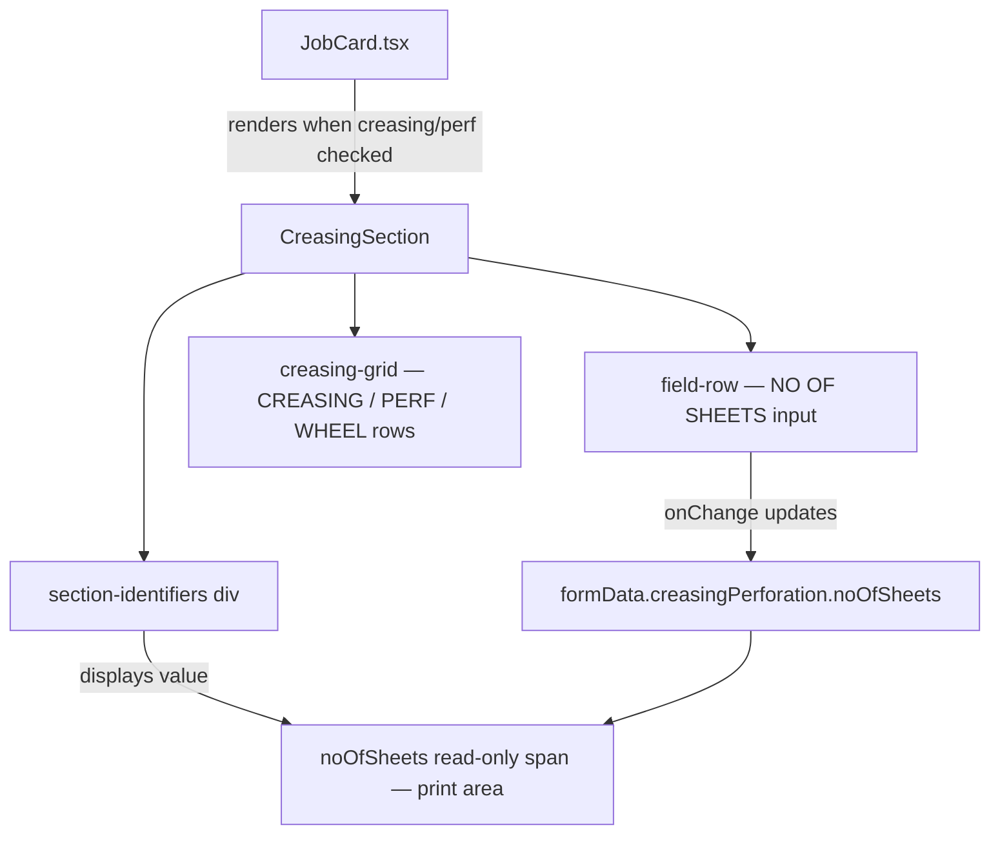
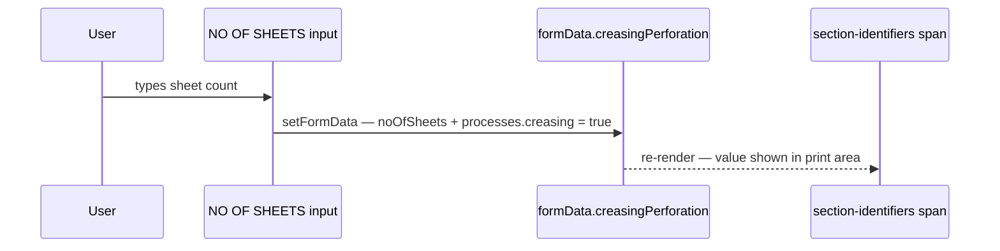

# Design Document: Creasing — No. of Sheets Field

## Overview

The `CreasingSection` component already contains a "NO OF SHEETS" input and its backing state (`creasingPerforation.noOfSheets`), but the field is intentionally hidden via `style={{ display: 'none' }}`. This feature makes the field visible, moves its display value into the `section-identifiers` print area (mirroring how `CornerCuttingSection` shows `noOfCards`), and adds auto-focus behaviour so the input receives focus when the section first mounts.

No backend, database, or state-shape changes are required — `creasingPerforation.noOfSheets` is already persisted in the MongoDB `JobCard` model and populated from the API.

---

## Architecture

The change is entirely contained within a single React component in the frontend.



The data flow is identical to `CornerCuttingSection`:



---

## Components and Interfaces

### CreasingSection (modified)

**File**: `printing-press-frontend/src/components/JobCardSections.tsx`

**Purpose**: Renders the Creasing / Perforation card section of the job card, now with a visible sheet count input and auto-focus.

**Props** (unchanged — `SectionProps`):

```typescript
interface SectionProps {
    jobData: { jobId: string; date?: Date; attBy?: string };
    customerName: string;
    formData: JobCardState;
    setFormData: React.Dispatch<React.SetStateAction<JobCardState>>;
    isPrint?: boolean;
}
```

**Internal changes**:

| Element | Before | After |
|---|---|---|
| `noOfSheets` `<input>` visibility | `style={{ display: 'none' }}`, `className="field-row no-print"` | Remove `style` override, keep `className="field-row no-print-row no-print"` (screen-only input row) |
| `section-identifiers` | Only shows JOB ID / JOB BY / C.NAME | Also renders `<span className="identifier-field only-print">{formData.creasingPerforation.noOfSheets} SHEETS</span>` |
| Auto-focus | None | `useRef` + `useEffect` with 500 ms delay (same pattern as `CornerCuttingSection` and `DieCuttingSection`) |
| `processes.creasing` flag | Already set `true` on `noOfSheets` change | Unchanged — already correct |

---

## Data Models

No changes to data models. The relevant shape (already exists):

```typescript
// useJobCardForm.ts — unchanged
creasingPerforation: {
    noOfSheets: string;   // ← this field is used
    date: string;
    creasing: boolean;
    creasingNo: string;
    perforation: boolean;
    perforationNo: string;
    wheelPerforation: boolean;
    wheelPerforationNo: string;
};
```

```javascript
// models/JobCard.js — unchanged
creasingPerforation: {
    noOfSheets: String,   // ← persisted to MongoDB
    // ...
}
```

---

## Algorithmic Pseudocode

### Mount / Auto-Focus Algorithm

```pascal
PROCEDURE CreasingSection.onMount()
  SEQUENCE
    noOfSheetsRef ← React.useRef(null)
    
    useEffect([], SEQUENCE
      timer ← setTimeout(500ms,
        SEQUENCE
          input ← noOfSheetsRef.current
          IF input IS NOT NULL THEN
            input.focus()
            input.scrollIntoView({ behavior: 'smooth', block: 'center' })
          END IF
        END SEQUENCE
      )
      RETURN () => clearTimeout(timer)   // cleanup
    END SEQUENCE)
  END SEQUENCE
END PROCEDURE
```

**Preconditions:**
- Component has mounted and `noOfSheetsRef` is attached to the DOM `<input>`.
- 500 ms delay ensures CSS transitions / grid layout have settled.

**Postconditions:**
- The `noOfSheets` input has browser focus.
- The section is scrolled into view.

**Loop Invariants:** N/A (no loops).

---

### Sheet Count Update Algorithm

```pascal
PROCEDURE handleNoOfSheetsChange(e: ChangeEvent)
  INPUT: e.target.value — new string entered by user
  OUTPUT: updated formData state

  SEQUENCE
    val ← e.target.value
    
    setFormData(prev →
      RETURN {
        ...prev,
        creasingPerforation: { ...prev.creasingPerforation, noOfSheets: val },
        processes: { ...prev.processes, creasing: true }
      }
    )
  END SEQUENCE
END PROCEDURE
```

**Preconditions:**
- `formData.creasingPerforation` is initialised (always true from `useJobCardForm`).

**Postconditions:**
- `formData.creasingPerforation.noOfSheets` equals the new value.
- `formData.processes.creasing` is `true` (section marked as active).
- The `section-identifiers` span re-renders with the updated count.

---

## Key Functions with Formal Specifications

### Visibility Fix

**Change**: Remove `style={{ display: 'none' }}` from the wrapping `<div>`.

**Before:**
```tsx
<div className="field-row no-print" style={{ display: 'none' }}>
```

**After:**
```tsx
<div className="field-row no-print-row no-print">
```

**Preconditions:** Component renders inside `CreasingSection`.  
**Postconditions:** Input is visible on screen; `no-print` CSS class hides it from print output.

---

### section-identifiers Display

**Change**: Add a `noOfSheets` span inside `section-identifiers`, conditionally rendered when a value exists — displayed in print output only.

**Before:**
```tsx
<div className="section-identifiers">
    <div className="identifier-fields-stack">
        <span className="identifier-field">JOB ID: {jobData.jobId}</span>
        <span className="identifier-field">JOB BY: {jobData.attBy || 'N/A'}</span>
        <span className="identifier-field only-print">C.NAME: {customerName}</span>
    </div>
    <div className="section-qr-code only-print">QR</div>
</div>
```

**After:**
```tsx
<div className="section-identifiers">
    <div className="identifier-fields-stack">
        <span className="identifier-field">JOB ID: {jobData.jobId}</span>
        <span className="identifier-field">JOB BY: {jobData.attBy || 'N/A'}</span>
        <span className="identifier-field only-print">C.NAME: {customerName}</span>
        {formData.creasingPerforation.noOfSheets && (
            <span className="identifier-field only-print">
                SHEETS: {formData.creasingPerforation.noOfSheets}
            </span>
        )}
    </div>
    <div className="section-qr-code only-print">QR</div>
</div>
```

**Preconditions:** `formData.creasingPerforation.noOfSheets` is a string (may be empty).  
**Postconditions:** Span renders when value is non-empty; hidden from screen via `only-print`; visible when printing.

---

### Auto-Focus (ref + useEffect)

**Change**: Convert `CreasingSection` from a plain arrow function to one that uses `React.useRef` and `React.useEffect`.

```pascal
ALGORITHM addAutoFocus()

BEFORE — function body:
  return (
    <div className="card-section" ...>
      ...
    </div>
  )

AFTER — function body:
  noOfSheetsRef ← React.useRef<HTMLInputElement>(null)

  React.useEffect(() => {
    timer ← setTimeout(500ms, () => {
      IF noOfSheetsRef.current THEN
        noOfSheetsRef.current.focus()
        noOfSheetsRef.current.scrollIntoView(...)
      END IF
    })
    RETURN () => clearTimeout(timer)
  }, [])   // runs once on mount

  ATTACH ref={noOfSheetsRef} to noOfSheets <input>
```

**Preconditions:**
- Component has just mounted (section was enabled by checking "CREASING / PERF").

**Postconditions:**
- `noOfSheets` input is focused after 500 ms.
- Timer is cleaned up on unmount to prevent memory leaks / stale focus calls.

---

## Example Usage

```tsx
// CreasingSection renders when processes.creasing or processes.perforation is true.
// After the change, opening the section will:

// 1. Show the NO OF SHEETS input immediately (no display:none)
// 2. Auto-focus it after 500ms
// 3. Any value typed updates formData.creasingPerforation.noOfSheets
//    and sets processes.creasing = true
// 4. When printing, the section-identifiers block shows:
//    JOB ID: 12345
//    JOB BY: Alice
//    C.NAME: ACME Corp
//    SHEETS: 500          ← new

// Minimal rendered output (screen):
<div class="card-section">
  <div class="section-header">CREASING / PERF</div>
  <div class="section-identifiers">
    <div class="identifier-fields-stack">
      <span class="identifier-field">JOB ID: 12345</span>
      <span class="identifier-field">JOB BY: Alice</span>
      <span class="identifier-field only-print">C.NAME: ACME Corp</span>
      <span class="identifier-field only-print">SHEETS: 500</span>  {/* new */}
    </div>
  </div>
  <div class="field-row no-print-row no-print"> {/* was hidden */}
    <span class="field-label-sm">NO OF SHEETS</span>
    <input type="text" ref={noOfSheetsRef} value="500" />
  </div>
  <div class="creasing-grid">
    {/* CREASING / PERFORATION / WHEEL PERFORATION rows — unchanged */}
  </div>
</div>
```

---

## Correctness Properties

- **Visibility**: After the change, `noOfSheets` input is rendered in the DOM without `display:none`. It is NOT printed (hidden by `no-print` CSS class).
- **Print area**: `SHEETS: {value}` appears in the `section-identifiers` block on print. If the value is empty, the span is not rendered.
- **State sync**: Typing in the `noOfSheets` input always results in `formData.creasingPerforation.noOfSheets === inputValue`.
- **Process flag**: After any change to `noOfSheets`, `formData.processes.creasing === true`.
- **Auto-focus**: On mount, `document.activeElement === noOfSheetsRef.current` after 500 ms (assuming no other focus change).
- **Persistence**: `noOfSheets` is saved to MongoDB via the existing API — no new fields or routes required.
- **No regression**: The `creasingNo`, `perforationNo`, `wheelPerforationNo` fields and their checkbox/process-flag logic are unchanged.

---

## Error Handling

| Scenario | Behaviour |
|---|---|
| Component unmounts before 500 ms timer fires | `clearTimeout` in `useEffect` cleanup prevents focus call on unmounted element — no error |
| `noOfSheets` value is empty string | `processes.creasing` is still set `true` (consistent with existing handler); `SHEETS:` span is not rendered in print area (conditional render) |
| User enters non-numeric text | Accepted as-is — field is `type="text"`, consistent with all other quantity fields in the job card |

---

## Testing Strategy

### Unit Testing Approach

- Render `CreasingSection` with a mock `formData` where `creasingPerforation.noOfSheets = ''`.
- Assert the `NO OF SHEETS` input is in the document and not hidden (no `display:none`).
- Simulate typing a value and assert `setFormData` was called with the correct `noOfSheets` update and `processes.creasing = true`.
- Assert `SHEETS:` span is absent when value is empty and present when non-empty.

### Property-Based Testing Approach

**Property test library**: fast-check (already in the React/TypeScript ecosystem)

- For any arbitrary non-empty string `s`, typing `s` into the `noOfSheets` input must:
  1. Set `formData.creasingPerforation.noOfSheets === s`
  2. Set `formData.processes.creasing === true`
  3. Render a `SHEETS: {s}` span in `section-identifiers`

### Integration Testing Approach

- Manual smoke test: Open job card → check "CREASING / PERF" → verify input appears and focuses → type a number → save → reload job card → verify value is restored from the API.

---

## Performance Considerations

No measurable performance impact. The change is:
- One additional React `useRef` allocation.
- One `useEffect` with a `setTimeout` (runs once, 500 ms, cleaned up on unmount).
- One conditional `<span>` render.

---

## Security Considerations

No new inputs or API endpoints are introduced. The `noOfSheets` field uses the same unsanitized-string approach as all other quantity fields in the job card. Input is stored as a plain string in MongoDB — no injection risk in this context.

---

## Dependencies

None — all changes are within existing files using existing libraries (`React`, `useJobCardForm`, `JobCardSections`). No new packages, routes, or DB migrations are required.
