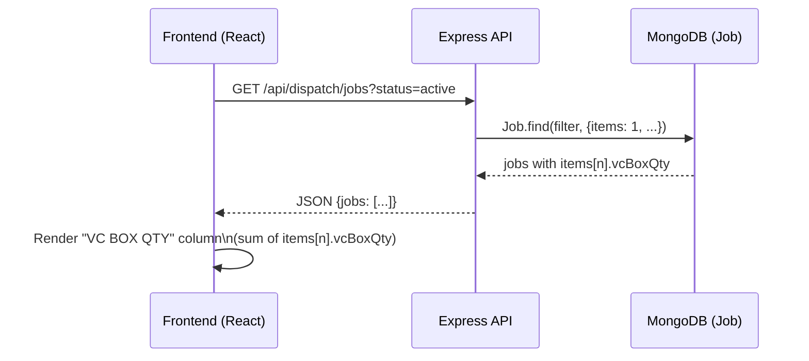

# Design Document: VC BOX QTY Column in Dispatch and Cashier Tables

## Overview

The VC BOX QTY field (stored as `vcBox.count` on a `JobCard` document) needs to be surfaced as a visible column in both the Dispatch table (`DispatchDashboard`) and the Cashier table (`CashierDashboard`). Currently this value exists only on the `JobCard` model and is not propagated to the `Job` model, which is the data source for both dashboards. The feature involves:

1. Adding a `vcBoxQty` field to the `Job` model (item-level, since each item has its own job card).
2. Propagating the value from `JobCard.vcBox.count` through `mergeJobCardIntoItem` into `Job.items[n].vcBoxQty`.
3. Including `vcBoxQty` in the API projections for dispatch and cashier job queries.
4. Adding a "VC BOX QTY" column to both frontend tables, showing a summarised value per job (sum or comma-separated list across items).

---

## Architecture

```mermaid
graph TD
    JC[JobCard Model\nvcBox.count]
    JCR[routes/jobCards.js\nPOST /api/job-cards]
    MJ[utils/jobCardToPostPress.js\nmergeJobCardIntoItem]
    JM[Job Model\nitems[n].vcBoxQty]
    DR[routes/dispatch.js\nGET /api/dispatch/jobs]
    CR[routes/cashier.js\nGET /api/cashier/jobs]
    DD[DispatchDashboard.tsx\nVC BOX QTY column]
    CD[CashierDashboard.tsx\nVC BOX QTY column]

    JC -->|read on save| JCR
    JCR --> MJ
    MJ -->|vcBoxQty written| JM
    JM -->|projected field| DR
    JM -->|projected field| CR
    DR -->|JSON response| DD
    CR -->|JSON response| CD
```

---

## Sequence Diagrams

### Job Card Save → VC BOX QTY Propagation

```mermaid
sequenceDiagram
    participant UI as Job Card UI
    participant JCR as routes/jobCards.js
    participant MJ as mergeJobCardIntoItem
    participant DB as MongoDB (Job)

    UI->>JCR: POST /api/job-cards {jobId, vcBox: {count: "5"}}
    JCR->>DB: JobCard.findOneAndUpdate(...)
    JCR->>DB: Job.findOne({jobId: baseJobId})
    JCR->>MJ: mergeJobCardIntoItem(item, cardBody)
    MJ-->>JCR: updatedItem with vcBoxQty: 5
    JCR->>DB: job.items[i].vcBoxQty = 5; job.save()
```

### Dispatch/Cashier Table Load



---

## Components and Interfaces

### Component 1: `mergeJobCardIntoItem` (utils/jobCardToPostPress.js)

**Purpose**: Maps fields from a `JobCard` document into the corresponding `Job.items` subdocument.

**Interface addition**:
```javascript
// New helper function
function pickVcBoxQty(card) {
  const proc = card.processes || {}
  if (!proc.ncBox) return 0
  return parseInt(card?.vcBox?.count, 10) || 0
}

// Added to the returned object inside mergeJobCardIntoItem()
{
  ...base,
  vcBoxQty: pickVcBoxQty(card),
  // ...all existing fields
}
```

**Responsibilities**:
- Extract `vcBox.count` from the job card only when `processes.ncBox` is `true`
- Return `0` when VC BOX is not checked or count is absent/non-numeric
- Apply consistently to both regular and ID-card merge paths

---

### Component 2: `Job` Model (models/Job.js)

**Purpose**: Persists job data including per-item workflow state.

**Interface addition** (inside the `items` array subdocument):
```javascript
vcBoxQty: { type: Number, default: 0 }
```

**Responsibilities**:
- Store the VC BOX quantity per item
- Default to `0` so existing documents are unaffected

---

### Component 3: Dispatch Route (routes/dispatch.js)

**Purpose**: Serves job data for the Dispatch dashboard.

**Interface change** — add `items` field to projection (already included) and ensure `vcBoxQty` is accessible. The existing projection already includes `items: 1`, so `vcBoxQty` will be included automatically once it is added to the model. No projection change is strictly needed, but verify `items` is not excluded.

**Current projection** (line ~118 of dispatch.js):
```javascript
{
  _id: 1, jobId: 1, customerName: 1, packingPreference: 1,
  paymentStatus: 1, totalItems: 1, parcels: 1,
  approvalRequested: 1, jobStatus: 1, dispatchedAt: 1,
  rackLocation: 1, itemScreenshots: 1, packingMode: 1,
  packingOverride: 1, createdAt: 1, defaultDeliveryType: 1,
  contactMe: 1, customerId: 1,
  items: 1   // ← already present; vcBoxQty auto-included
}
```

No change needed here — `items: 1` already brings the full items array.

---

### Component 4: Cashier Route (routes/cashier.js)

**Purpose**: Serves job data for the Cashier dashboard.

**Interface change** — add `items` to the projection so `vcBoxQty` is returned:

```javascript
// Before
const jobs = await Job.find(filter, {
  _id: 0, jobId: 1, customerName: 1,
  paymentStatus: 1, jobStatus: 1, createdAt: 1, customerId: 1
})

// After
const jobs = await Job.find(filter, {
  _id: 0, jobId: 1, customerName: 1,
  paymentStatus: 1, jobStatus: 1, createdAt: 1, customerId: 1,
  items: 1   // ← add to bring vcBoxQty
})
```

---

### Component 5: `DispatchDashboard.tsx`

**Purpose**: Renders the Dispatch table with job rows.

**Interface change** — add a "VC BOX QTY" `<th>` in the table header and a `<td>` in each row that computes the total VC BOX qty across all items in the job.

**Helper function** (colocated in the component):
```typescript
function jobVcBoxQty(job: any): number {
  return (job.items || []).reduce(
    (sum: number, item: any) => sum + (Number(item.vcBoxQty) || 0),
    0
  )
}
```

**Column placement**: After the "Packing" column and before the "Rack" column.

---

### Component 6: `CashierDashboard.tsx`

**Purpose**: Renders the Cashier table with job rows.

**Interface change** — same helper and column pattern as DispatchDashboard.

**Column placement**: After the "Customer" column and before the "Created At" column (to keep VC BOX near job identity information).

---

## Data Models

### Updated `Job.items` subdocument

```javascript
{
  // ... all existing fields ...
  vcBoxQty: { type: Number, default: 0 }
}
```

**Validation Rules**:
- Must be a non-negative integer
- `0` means VC BOX is not used for this item
- Populated by `mergeJobCardIntoItem` when `processes.ncBox === true`

### `JobCard` (no change)

```javascript
vcBox: {
  count: String   // already exists, no schema change needed
},
processes: {
  ncBox: Boolean  // already exists
}
```

---

## Key Functions with Formal Specifications

### `pickVcBoxQty(card)`

```javascript
function pickVcBoxQty(card) {
  const proc = card.processes || {}
  if (!proc.ncBox) return 0
  return parseInt(card?.vcBox?.count, 10) || 0
}
```

**Preconditions**:
- `card` is a plain object or Mongoose document (may be null/undefined-safe via optional chaining)

**Postconditions**:
- Returns `0` when `processes.ncBox` is falsy
- Returns `0` when `vcBox.count` is absent, empty, or non-numeric
- Returns a non-negative integer equal to `parseInt(vcBox.count)` when VC BOX is active and count is numeric

---

### `jobVcBoxQty(job)` (frontend helper)

```typescript
function jobVcBoxQty(job: any): number {
  return (job.items || []).reduce(
    (sum: number, item: any) => sum + (Number(item.vcBoxQty) || 0),
    0
  )
}
```

**Preconditions**:
- `job` is a job object from the API response (may have no `items` array)

**Postconditions**:
- Returns `0` when `items` is absent or empty
- Returns the sum of all `vcBoxQty` values across all items
- Never throws; safely handles missing/null item fields

---

## Algorithmic Pseudocode

### Job Card Save → Propagation to Job.items

```pascal
ALGORITHM saveJobCardAndSync(cardData)
INPUT: cardData — the request body from POST /api/job-cards
OUTPUT: savedJobCard

BEGIN
  // 1. Persist or update JobCard
  jobCard ← JobCard.findOneAndUpdate({jobId: cardData.jobId}, cardData)

  // 2. Parse base job ID and item index from composite jobId
  // e.g. "36259-120626_0" → baseJobId="36259-120626", itemIndex=0
  match ← cardData.jobId.match(/^(.+)_(\d+)$/)

  IF match EXISTS THEN
    baseJobId   ← match[1]
    itemIndex   ← parseInt(match[2])
    job         ← Job.findOne({jobId: baseJobId})

    IF job EXISTS AND job.items[itemIndex] EXISTS THEN
      // 3. Merge all job card fields (including vcBoxQty) into item
      updatedItem ← mergeJobCardIntoItem(job.items[itemIndex], cardData)
      job.items[itemIndex] ← updatedItem
      refreshItemStages(job)
      job.save()
    END IF
  END IF

  RETURN jobCard
END
```

### Render VC BOX QTY Column Cell

```pascal
ALGORITHM renderVcBoxCell(job)
INPUT: job — a job object from the API
OUTPUT: React table cell

BEGIN
  total ← 0
  FOR each item IN (job.items OR []) DO
    total ← total + (toNumber(item.vcBoxQty) OR 0)
  END FOR

  IF total > 0 THEN
    RETURN <td><span className="vc-box-badge">{total}</span></td>
  ELSE
    RETURN <td><span style={{color: '#94a3b8'}}>—</span></td>
  END IF
END
```

---

## Example Usage

### Backend: After the fix, a saved job card with VC BOX checked

```javascript
// POST /api/job-cards body:
{
  jobId: "36259-120626_0",
  processes: { ncBox: true, ... },
  vcBox: { count: "5" },
  // ...
}

// Result in Job.items[0]:
{
  vcBoxQty: 5,   // ← new field
  // ...all existing fields
}
```

### Frontend: Dispatch table row rendering

```typescript
// In DispatchDashboard.tsx table body
const vcQty = jobVcBoxQty(job)   // e.g. 5 (sum across items)

<td>
  {vcQty > 0
    ? <span className="vc-box-badge">{vcQty}</span>
    : <span style={{ color: '#94a3b8' }}>—</span>
  }
</td>
```

### Frontend: Cashier table row rendering

```typescript
// Same helper, same pattern in CashierDashboard.tsx
const vcQty = jobVcBoxQty(job)

<td>
  {vcQty > 0
    ? <span style={{ fontWeight: 700, color: '#7c3aed' }}>{vcQty}</span>
    : '—'
  }
</td>
```

---

## Error Handling

### Error Scenario 1: `vcBox.count` is non-numeric or missing

**Condition**: Job card saved with `processes.ncBox = true` but `vcBox.count` is `""`, `null`, or a string like `"N/A"`.

**Response**: `pickVcBoxQty` returns `0` via the `|| 0` fallback. The item stores `vcBoxQty: 0` rather than `NaN` or throwing.

**Recovery**: No recovery needed — `0` is the correct neutral value.

---

### Error Scenario 2: Existing jobs have no `vcBoxQty` field

**Condition**: Jobs created before this feature is deployed will not have `vcBoxQty` on their items.

**Response**: The `default: 0` on the schema means Mongoose returns `0` for missing fields. The frontend `Number(item.vcBoxQty) || 0` guard also handles `undefined`.

**Recovery**: Optional backfill script can run `Job.updateMany` to set `items.$[].vcBoxQty = 0` on all existing documents, but it is not required for correctness.

---

### Error Scenario 3: `items` not in cashier query response

**Condition**: Before the cashier projection fix, `items` is absent from the response.

**Response**: The frontend helper `(job.items || []).reduce(...)` returns `0` safely. Column shows "—" rather than a broken value.

**Recovery**: Applying the cashier route projection change resolves this permanently.

---

## Testing Strategy

### Unit Testing Approach

Test `pickVcBoxQty` in isolation:

| Input | Expected Output |
|---|---|
| `{ processes: { ncBox: true }, vcBox: { count: '5' } }` | `5` |
| `{ processes: { ncBox: false }, vcBox: { count: '5' } }` | `0` |
| `{ processes: { ncBox: true }, vcBox: { count: '' } }` | `0` |
| `{ processes: { ncBox: true }, vcBox: {} }` | `0` |
| `{ processes: {}, vcBox: { count: '3' } }` | `0` |
| `{}` | `0` |

Test `jobVcBoxQty` frontend helper:

| Input | Expected Output |
|---|---|
| `{ items: [{ vcBoxQty: 5 }, { vcBoxQty: 3 }] }` | `8` |
| `{ items: [] }` | `0` |
| `{}` | `0` |
| `{ items: [{ vcBoxQty: 0 }, {}] }` | `0` |

### Integration Testing Approach

1. Save a job card with `processes.ncBox = true` and `vcBox.count = "7"` via `POST /api/job-cards`.
2. Fetch the parent job via `GET /api/dispatch/jobs` — verify `items[0].vcBoxQty === 7`.
3. Fetch via `GET /api/cashier/jobs` — verify `items[0].vcBoxQty === 7`.
4. Save another job card for a second item with `processes.ncBox = false` — verify `items[1].vcBoxQty === 0`.
5. Confirm the Dispatch table renders `7` in the VC BOX QTY column for that job.
6. Confirm the Cashier table renders `7` in the VC BOX QTY column for that job.

---

## Performance Considerations

- `items` is already projected in the dispatch query. Adding `vcBoxQty` to the item subdoc adds negligible payload overhead (one integer per item).
- The cashier query now includes `items`, which is a new addition. Since cashier typically shows jobs for a single day (20–100 records), the added payload is acceptable.
- No additional database indexes are needed — the filter and sort remain unchanged.

---

## Security Considerations

- `vcBoxQty` is a read-only derived value in the context of Dispatch and Cashier — neither role writes to it. No RBAC change is required.
- The field is numeric and bounded by `parseInt`, so no injection risk.

---

## Dependencies

- No new npm packages or libraries required.
- All changes are confined to:
  - `models/Job.js`
  - `utils/jobCardToPostPress.js`
  - `routes/cashier.js`
  - `printing-press-frontend/src/modules/despatch/DispatchDashboard.tsx`
  - `printing-press-frontend/src/modules/cashier/CashierDashboard.tsx`
- The `routes/dispatch.js` file requires **no changes** — it already projects `items: 1`.
